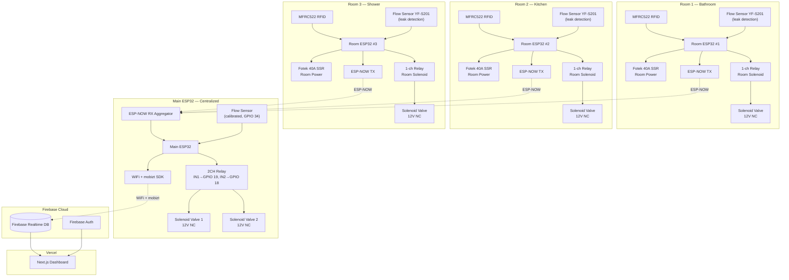
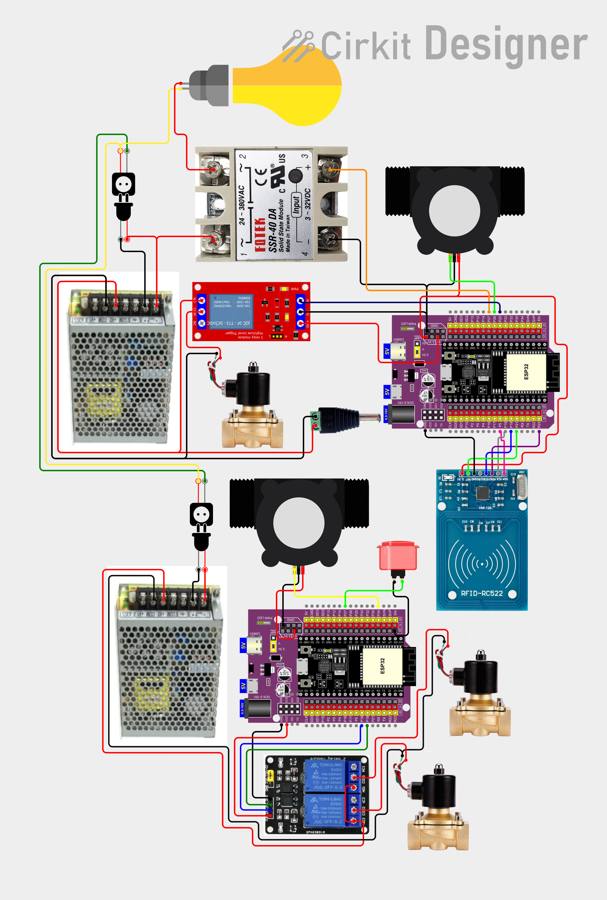
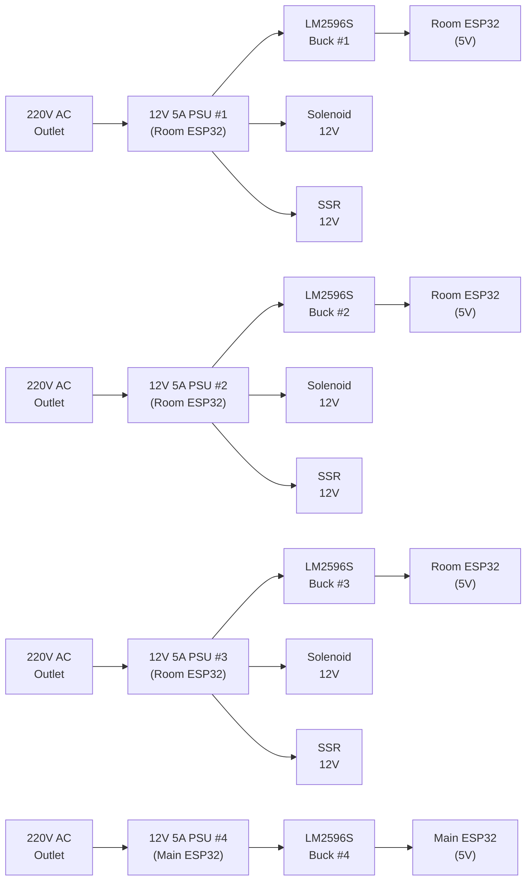
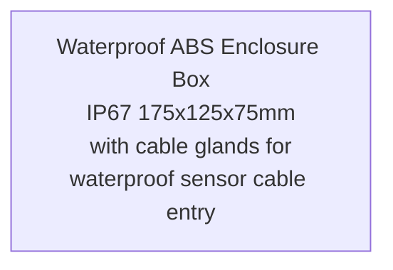

# Block Diagram — TapFlow (ESP-NOW + WiFi → Firebase)

## System Block Diagram

> Mermaid-based diagram (SVG export removed; source below)

<details>
<summary><b> Mermaid Source</b> (click to expand)</summary>



</details>

---

## Waterline Structure (Plumbing)

```
Water Tank (500-1000L)
    │
    ▼
Fittings → 1" Pipe
    │
    ▼
Reducer Fittings (1" → 1/2")
    │
    ▼
╔═══════════════════════════════════════════════════╗
║  MAIN ESP32 CONTROL ZONE                          ║
║                                                   ║
║  Solenoid Valve 1 (12V NC) ◄── 2CH Relay IN1     ║
║       │                                           ║
║       ▼                                           ║
║  Flow Sensor (calibrated) ◄── GPIO 34            ║
║       │                                           ║
║       ▼                                           ║
║  Solenoid Valve 2 (12V NC) ◄── 2CH Relay IN2     ║
╚═══════════════════════════════════════════════════╝
    │
    ▼
T-Connector → 1/2" PPE Pipe
    │
    ├──→ Room 1 (Bathroom)
    ├──→ Room 2 (Kitchen)
    └──→ Room 3 (Shower)
```

> **Dual Solenoid Design:** Two solenoid valves in series for redundancy — if one fails stuck open, the other can still shut off water. Flow sensor placed between solenoids for accurate metering of total household consumption.

---

## Pin Connections

### Room ESP32s (×3) — RFID + flow sensor + SSR + relay + solenoid

| Component | Interface | Pins | Notes |
|-----------|-----------|------|-------|
| **MFRC522 RFID** | SPI | SDA→GPIO 5, SCK→GPIO 18, MOSI→GPIO 23, MISO→GPIO 19, RST→GPIO 21 | Reads Mifare Classic cards |
| **YF-S201 Flow Sensor** | Digital | GPIO 26 | Leak detection only (uncalibrated) |
| **Fotek 40A SSR** | Digital | GPIO 27 | Room power — controls lights, fan, appliances |
| **1-ch Relay 10A** | Digital | GPIO 25 | Solenoid valve control |
| **Built-in LED** | Digital | GPIO 2 | Status indication |
| **Power** | 12V jack | 6.5–16V input | Expansion board accepts 12V from switching PSU |

### Main ESP32 — Centralized Control (WiFi + 2CH relay + solenoids + calibrated flow sensor)

| Component | Interface | Pins | Notes |
|-----------|-----------|------|-------|
| **YF-S201 Flow Sensor** | Digital | GPIO 34 | Calibrated — accurate metering |
| **2CH Relay (Solenoid 1)** | Digital | GPIO 19 | HIGH = water flows, LOW = shutoff |
| **2CH Relay (Solenoid 2)** | Digital | GPIO 18 | HIGH = water flows, LOW = shutoff |
| **Solenoid Valve ×2** | Via 2CH relay | 12V NC | COM→solenoid+, NO→PSU+, solenoid-→PSU- |
| **Reset Button** | Digital | GPIO 27 | Arcade button — press to reset WiFi creds |
| **WiFi** | WiFi + mobizt SDK | — | Connects to Firebase RTDB |
| **ESP-NOW RX** | ESP-NOW | — | Receives RFID + leak alerts from room ESP32s |
| **Built-in LED** | Digital | GPIO 2 | Status indication |
| **Power** | 12V jack | 6.5–16V input | Expansion board accepts 12V from switching PSU |

---

## Wiring Diagram

### Interactive Wiring Diagram (Cirkit Designer)
**🔗 [View Interactive Wiring Diagram](https://app.cirkitdesigner.com/project/b0b4579e-313d-4faa-9cd1-f955daa204a5)**

### Static Wiring Diagram (PNG)



---

## Simplified Wiring

### Room ESP32 (×3 — same wiring each)
```
Room ESP32 38-Pin Expansion Board
┌─────────────────────────────────────────────────────┐
│                                                     │
│  SPI Bus (MFRC522 RFID):                           │
│  [5]  ──────┬── MFRC522 SDA (NSS)                  │
│  [18] ──────┬── MFRC522 SCK                        │
│  [23] ──────┬── MFRC522 MOSI                       │
│  [19] ──────┬── MFRC522 MISO                       │
│  [21] ──────┬── MFRC522 RST                        │
│  3V   ──────┬── MFRC522 3.3V                       │
│  GND  ──────┬── MFRC522 GND                        │
│                                                     │
│  Flow Sensor (leak detection — uncalibrated):      │
│  [26] ──────┬── YF-S201 Signal (Yellow)            │
│  5V   ──────┬── YF-S201 VCC (Red)                  │
│  GND  ──────┬── YF-S201 GND (Black)                │
│                                                     │
│  SSR (Room Power — lights, fan, appliances):       │
│  [27] ──────┬── Fotek 40A SSR Input +              │
│  GND  ──────┬── Fotek 40A SSR Input -              │
│  SSR OUT1 ──┬── 220V line                          │
│  SSR OUT2 ──┬── Appliance 1st wire                 │
│  Appliance 2nd wire ── 220V line                   │
│                                                     │
│  Relay (Solenoid Valve):                           │
│  [25] ──────┬── 1-ch Relay IN                      │
│  5V   ──────┬── Relay VCC                          │
│  GND  ──────┬── Relay GND                          │
│  Relay COM ──┬── Solenoid +                        │
│  Relay NO  ──┬── PSU + (12V)                       │
│  Solenoid - ── PSU - (directly)                    │
│                                                     │
│  Power: 12V jack input (6.5–16V from PSU)          │
└─────────────────────────────────────────────────────┘
```

### Main ESP32 — Centralized Control
```
Main ESP32 38-Pin Expansion Board
┌─────────────────────────────────────────────────────┐
│                                                     │
│  Flow Sensor (calibrated — accurate metering):     │
│  [34] ──────┬── YF-S201 Signal (Yellow)            │
│  5V   ──────┬── YF-S201 VCC (Red)                  │
│  GND  ──────┬── YF-S201 GND (Black)                │
│                                                     │
│  2CH Relay (Solenoid Valves 1 & 2):                │
│  5V   ──────┬── Relay VCC                           │
│  GND  ──────┬── Relay GND                           │
│  [19] ──────┬── Relay IN1 (Solenoid 1)              │
│  [18] ──────┬── Relay IN2 (Solenoid 2)              │
│  COM1 ──────┬── Solenoid 1 +                        │
│  COM2 ──────┬── Solenoid 2 +                        │
│  NO1  ──────┬── PSU + (12V)                         │
│  NO2  ──────┬── PSU + (12V)                         │
│  Solenoid 1- ── PSU - (directly)                    │
│  Solenoid 2- ── PSU - (directly)                    │
│                                                     │
│  Reset Button (WiFi creds reset):                  │
│  [27] ──────┬── Arcade Button Pin 2                 │
│  GND  ──────┬── Arcade Button Pin 1                 │
│                                                     │
│  WiFi + ESP-NOW RX (receives from room ESP32s)     │
│  [2]  ──────┬── Built-in LED (status)               │
│                                                     │
│  Power: 12V jack input (6.5–16V from PSU)          │
└─────────────────────────────────────────────────────┘
```
> Main ESP32 is centralized before the rooms. It controls both solenoid valves via 2CH relay and reads the calibrated flow sensor. Room ESP32s report RFID taps and leak alerts wirelessly via ESP-NOW. Arcade button on GPIO 27 allows resetting WiFi credentials.

---

## Smart Solenoid Control Flow (per Room)

```
┌─────────────────────────────────────────────────────────────────┐
│                     RFID TAP VALID                               │
│                                                                 │
│  Customer taps card  ──▶  MFRC522 reads  ──▶  Validate card     │
│                                                      │          │
│                                              ┌───────┴───────┐  │
│                                              │  Valid card?   │  │
│                                              └───────┬───────┘  │
│                                                  YES │          │
│                                                      ▼          │
│                                              SSR ON + Solenoid ON│
│                                              (water flows)       │
└─────────────────────────────────────────────────────────────────┘

┌─────────────────────────────────────────────────────────────────┐
│                   SMART SOLENOID CONTROL                         │
│                                                                 │
│  Flow sensor active? ──▶ YES ──▶ Solenoid stays ON              │
│         │                                                     │
│         NO (no flow for N sec)                                │
│         │                                                     │
│         ▼                                                     │
│  Solenoid OFF automatically (prevents overheating)             │
│         │                                                     │
│         ▼                                                     │
│  Next flow detected? ──▶ YES ──▶ Solenoid ON again             │
└─────────────────────────────────────────────────────────────────┘

┌─────────────────────────────────────────────────────────────────┐
│                      SESSION END                                │
│                                                                 │
│  Timeout (no flow X min) ──▶ SSR OFF (room power off)           │
│  Tap card again           ──▶ SSR OFF (session ends)            │
│  Leak detected            ──▶ SSR OFF + Solenoid OFF (emergency)│
└─────────────────────────────────────────────────────────────────┘
```

> **Key principle:** Solenoid is ONLY energized when water is actually flowing. This prevents the solenoid from overheating due to continuous energization.

---

## Leak Detection Scenarios (6 Rules)

```
┌─────────────────────────────────────────────────────────────────┐
│  RULE 1: NO RFID + FLOW DETECTED           → CRITICAL LEAK     │
│  ─────────────────────────────────────────────────────────────  │
│  No customer in room (no session) but flow sensor reads water.  │
│  Cause: Broken pipe, burst fitting, upstream valve failure.     │
│  Action: EMERGENCY SHUTOFF + ALERT                              │
└─────────────────────────────────────────────────────────────────┘

┌─────────────────────────────────────────────────────────────────┐
│  RULE 2: SESSION ENDED + FLOW CONTINUES   → SOLENOID STUCK     │
│  ─────────────────────────────────────────────────────────────  │
│  Customer left (SSR OFF) but water still flowing.              │
│  Cause: Solenoid valve physically stuck open.                   │
│  Action: EMERGENCY SHUTOFF + ALERT + CHECK SOLENOID HARDWARE   │
└─────────────────────────────────────────────────────────────────┘

┌─────────────────────────────────────────────────────────────────┐
│  RULE 3: SOLENOID OFF + FLOW DETECTED     → HARDWARE FAILURE   │
│  ─────────────────────────────────────────────────────────────  │
│  Valve commanded closed but flow sensor still reads water.     │
│  Cause: Solenoid stuck, SSR welded contacts, pipe burst.       │
│  Action: EMERGENCY SHUTOFF + ALERT + CHECK SSR + SOLENOID      │
└─────────────────────────────────────────────────────────────────┘

┌─────────────────────────────────────────────────────────────────┐
│  RULE 4: CONTINUOUS FLOW > 30 MIN          → STUCK VALVE       │
│  ─────────────────────────────────────────────────────────────  │
│  Water flowing non-stop for 30+ minutes.                        │
│  Cause: Stuck valve, running toilet, forgotten faucet.         │
│  Action: EMERGENCY SHUTOFF + ALERT                              │
└─────────────────────────────────────────────────────────────────┘

┌─────────────────────────────────────────────────────────────────┐
│  RULE 5: DRIP (0.1–0.5 L/min) > 5 MIN     → DRIP LEAK          │
│  ─────────────────────────────────────────────────────────────  │
│  Slow, steady trickle for extended time.                        │
│  Cause: Dripping faucet, loose fitting, worn washer.           │
│  Action: EMERGENCY SHUTOFF + ALERT                              │
└─────────────────────────────────────────────────────────────────┘

┌─────────────────────────────────────────────────────────────────┐
│  RULE 6: NIGHT FLOW (22:00–05:00) NO SESSION → SUSPICIOUS      │
│  ─────────────────────────────────────────────────────────────  │
│  Water flowing during sleeping hours with no authorized user.   │
│  Cause: Unauthorized use, hidden leak, pipe burst at night.    │
│  Action: EMERGENCY SHUTOFF + ALERT                              │
└─────────────────────────────────────────────────────────────────┘
```

> **All 6 rules trigger the same emergency response:**
> 1. SSR OFF (room power cut)
> 2. Solenoid OFF (water stopped)
> 3. Alert sent via ESP-NOW → Main ESP32 → Firebase RTDB → Next.js dashboard notification
> 4. Event logged to SPIFFS + Firebase RTDB for audit trail

---

## Sensor Wiring (YF-S201) — per Room ESP32

```
YF-S201 Flow Sensor
┌──────────────┐
│              │
│  Red   ─────┼──── 5V (VIN from Room ESP32)
│  Black ─────┼──── GND
│  Yellow ────┼──── GPIO 26 — direct connection
│              │
│  [Flow →]    │   ← Arrow indicates water flow direction
└──────────────┘
```

> **Important:** The arrow on the sensor body MUST point in the direction of water flow. Installing it backwards will give no readings.

Each YF-S201 sensor has 3 wires: **Red (VCC)**, **Black (GND)**, **Yellow (Signal)**

| Connection | Wire Color | Pin |
|------------|------------|-----|
| VCC | Red | 5V |
| GND | Black | GND |
| Signal | Yellow | GPIO 26 |

---

## Power Distribution

> Mermaid-based diagram (SVG export removed; source below)

<details>
<summary><b> Mermaid Source</b> (click to expand)</summary>



</details>

> **Power Architecture:**
> - **Each ESP32 has its own dedicated power supply** — no shared rails
> - **220V AC** → **12V 5A Switching PSU (S-60-12)** → **LM2596S Buck Converter** → **5V** for ESP32 + sensors
> - **12V rail** powers solenoid valves and SSR relays directly per room
> - **4 total:** 3 for room ESP32s + 1 for main ESP32
> - Main ESP32 connects to WiFi directly

---

## Component Layout (Enclosure)

> Mermaid-based diagram (SVG export removed; source below)

<details>
<summary><b> Mermaid Source</b> (click to expand)</summary>



</details>

> **Enclosure:** Waterproof ABS Enclosure Box IP67 175x125x75mm with cable glands for waterproof sensor cable entry.

---

## Pinout Reference (ESP32 DevKit V1 38-Pin)

```
                   ┌─────────────┐
             EN ──┤ 1         38├── VBAT
           GPIO36─┤ 2         37├── GPIO15 (HSPI_CS)
           GPIO39─┤ 3         36├── GPIO2 (LED)
           GPIO34─┤ 4         35├── GPIO0 (BOOT)
           GPIO35─┤ 5         34├── GPIO4
           GPIO32─┤ 6         33├── GPIO16 (RXD2)
           GPIO33─┤ 7         32├── GPIO17 (TXD2)
           GPIO25─┤ 8         31├── GPIO5
           GPIO26─┤ 9         30├── GPIO18
           GPIO27─┤ 10        29├── GPIO19
           GPIO14─┤ 11        28├── GPIO21
           GPIO12─┤ 12        27├── GPIO22
           GPIO13─┤ 13        26├── GPIO23
              GND─┤ 14        25├── RXD0 (GPIO3)
           GPIO15─┤ 15        24├── TXD0 (GPIO1)
              GND─┤ 16        23├── (NC)
            3.3V ─┤ 17        22├── (NC)
             5V  ─┤ 18        21├── (NC)
              GND─┤ 19        20├── GND
                   └─────────────┘
```

> **Room ESP32 pin usage:** GPIO 26 (flow sensor), GPIO 27 (SSR), GPIO 25 (solenoid relay), GPIO 5/18/19/23 (RFID SPI) + GPIO 21 (RST). Direct connection, no pull-up resistors needed (YF-S201 outputs digital pulses).

---

## ESP-NOW Protocol (Room → Main ESP32)

**Wireless:** ESP-NOW (no WiFi router needed)  
**Payload:** Binary struct (low-latency)

### Room → Main (every 5 sec)
```json
{"room_id": 1, "ts": 1703123456789, "pulses": 127, "flow_rate_lpm": 2.34, "volume_ml": 456, "leak_alert": false}
```

### Main → Room (command, on demand)
```json
{"cmd": "calibrate", "ppl": 450}
{"cmd": "reset_counters"}
```

---

## Firebase RTDB Structure (Main ESP32 → Firebase)

**Format:** JSON Lines (newline-delimited JSON)  
**Encoding:** UTF-8

### Aggregated Data Frame (every 5 sec)
```json
{"device_id": "tapflow-main", "ts": 1703123456789, "rooms": [{"room_id": 1, "flow_rate_lpm": 2.34, "volume_ml": 456}, {"room_id": 2, "flow_rate_lpm": 0.0, "volume_ml": 0}, {"room_id": 3, "flow_rate_lpm": 1.12, "volume_ml": 210}]}
```

### Alert Frame (leak detected)
```json
{"device_id": "tapflow-main", "ts": 1703123456789, "type": "alert", "level": "major_leak", "room_id": 2, "flow_rate_lpm": 15.2, "duration_sec": 45, "message": "Major leak detected in Kitchen"}
```

### Command Frame (Firebase → Main ESP32 via mobizt stream)
```json
{"cmd": "shutoff", "room_id": 1}
{"cmd": "calibrate", "room_id": 2, "ppl": 450}
{"cmd": "reset_counters"}
```

---

## Wiring Summary

### 3 Room ESP32s — each gets 1 YF-S201 sensor
Each sensor: Red → 5V, Black → GND, Yellow → GPIO 26

### Main ESP32 — WiFi + Firebase + Centralized Valves

- Calibrated YF-S201 flow sensor: Red → 5V, Black → GND, Yellow → GPIO 34
- 2CH relay: IN1 → GPIO 19 (Solenoid 1), IN2 → GPIO 18 (Solenoid 2)
- No SSR on main — room power SSRs live on the room ESP32s; each room also drives its own solenoid via its 1-ch relay (GPIO 25)
- WiFi connects to Firebase RTDB via mobizt Firebase-ESP-Client

> **ESP-NOW:** No wiring between room ESP32s and main ESP32 — communication is wireless via ESP-NOW protocol.

---

## Wiring Resources

| Resource | Description | Link |
|----------|-------------|------|
| **Interactive Wiring Diagram** | Cirkit Designer (clickable, zoomable) | [app.cirkitdesigner.com/project/b0b4579e-313d-4faa-9cd1-f955daa204a5](https://app.cirkitdesigner.com/project/b0b4579e-313d-4faa-9cd1-f955daa204a5) |
| **Static Wiring Diagram** | PNG image for docs | `../wiring/smartrooms.png` |


---

## 3D Enclosure Models

All 3D models and Fusion 360 source files are in the `models/` folder:

| File | Description |
|------|-------------|
| `TapFlow.f3d` | Fusion 360 source file (editable) |
| `tapflow_view_1.png` | Fixture view 1 |
| `tapflow_view_2.png` | Fixture view 2 |
| `tapflow_view_3.png` | Fixture view 3 |
| `tapflow_view_4.png` | Fixture view 4 |
| `tapflow_view_5.png` | Fixture view 5 |
| `tapflow_view_6.png` | Fixture view 6 |
| `tapflow_view_7.png` | Fixture view 7 |
| `tapflow_view_8.png` | Fixture view 8 |

> Use the `.f3d` file in Fusion 360 to modify the enclosure design, add mounting holes, or adjust dimensions for different components.