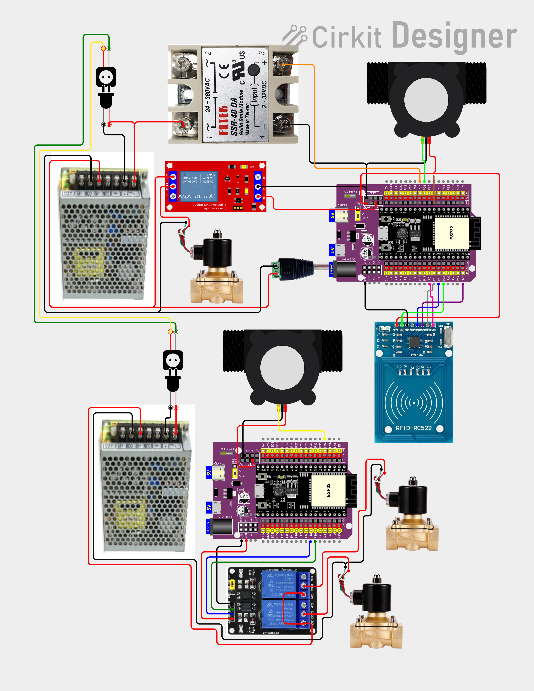
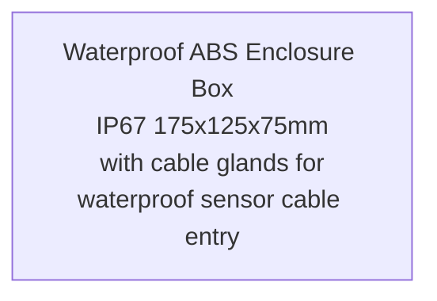

# Block Diagram — Water Meter with Leak Detection (ESP-NOW + WiFi → Firebase)

## System Block Diagram

> Mermaid-based diagram (SVG export removed; source below)

<details>
<summary><b> Mermaid Source</b> (click to expand)</summary>

```mermaid
graph TB
    subgraph "Room 1 — Bathroom"
        RFID1[MFRC522 RFID] --> R1[Room ESP32 #1]
        R1S[Flow Sensor YF-S201\n(leak detection)] --> R1
        R1 --> R1E[ESP-NOW TX]
    end

    subgraph "Room 2 — Kitchen"
        RFID2[MFRC522 RFID] --> R2[Room ESP32 #2]
        R2S[Flow Sensor YF-S201\n(leak detection)] --> R2
        R2 --> R2E[ESP-NOW TX]
    end

    subgraph "Room 3 — Shower"
        RFID3[MFRC522 RFID] --> R3[Room ESP32 #3]
        R3S[Flow Sensor YF-S201\n(leak detection)] --> R3
        R3 --> R3E[ESP-NOW TX]
    end

    subgraph "Main ESP32 — Centralized"
        ESPRX[ESP-NOW RX Aggregator] --> MAIN[Main ESP32]
        MFS[Flow Sensor\n(calibrated, GPIO 34)] --> MAIN
        MAIN --> RELAY1[1-ch Relay 10A\nSolenoid 1]
        MAIN --> RELAY2[1-ch Relay 10A\nSolenoid 2]
        RELAY1 --> SOL1[Solenoid Valve 1\n12V NC]
        RELAY2 --> SOL2[Solenoid Valve 2\n12V NC]
        MAIN --> WIFI[WiFi + mobizt SDK]
    end

    subgraph "Firebase Cloud"
        RTDB[(Firebase Realtime DB)]
        AUTH[Firebase Auth]
    end

    subgraph "Vercel"
        NEXT[Next.js Dashboard]
    end

    WIFI -.->|WiFi + mobizt| RTDB
    RTDB --> NEXT
    AUTH --> NEXT

    R1E -.->|ESP-NOW| ESPRX
    R2E -.->|ESP-NOW| ESPRX
    R3E -.->|ESP-NOW| ESPRX
```

</details>

---

## Pin Connections

### Room ESP32s (×3) — RFID + leak detection flow sensor

| Component | Interface | Pins | Notes |
|-----------|-----------|------|-------|
| **MFRC522 RFID** | SPI | SDA→GPIO 5, SCK→GPIO 18, MOSI→GPIO 23, MISO→GPIO 19, RST→GPIO 27 | Reads Mifare Classic cards |
| **YF-S201 Flow Sensor** | Digital | GPIO 26 | Leak detection only (uncalibrated) |
| **Built-in LED** | Digital | GPIO 2 | Status indication |

### Main ESP32 — Centralized Control (WiFi + relays + solenoids + calibrated flow sensor)

| Component | Interface | Pins | Notes |
|-----------|-----------|------|-------|
| **YF-S201 Flow Sensor** | Digital | GPIO 34 | Calibrated — accurate metering |
| **1-ch Relay 10A (Solenoid 1)** | Digital | GPIO 25 | HIGH = water flows, LOW = shutoff |
| **1-ch Relay 10A (Solenoid 2)** | Digital | GPIO 13 | HIGH = water flows, LOW = shutoff |
| **Solenoid Valve ×2** | Via relays | 12V NC | Normally closed — opens when relay fires |
| **WiFi** | WiFi + mobizt SDK | — | Connects to Firebase RTDB |
| **ESP-NOW RX** | ESP-NOW | — | Receives RFID + leak alerts from room ESP32s |
| **Built-in LED** | Digital | GPIO 2 | Status indication |

---

## Wiring Diagram

### Interactive Wiring Diagram (Cirkit Designer)
**🔗 [View Interactive Wiring Diagram](https://app.cirkitdesigner.com/project/b0b4579e-313d-4faa-9cd1-f955daa204a5)**

### Static Wiring Diagram (PNG)



---

## Simplified Wiring

### Room ESP32 (×3 — same wiring each)
```
Room ESP32 38-Pin Expansion Board
┌─────────────────────────────────────────────────────┐
│                                                     │
│  SPI Bus (MFRC522 RFID):                           │
│  [5]  ──────┬── MFRC522 SDA (NSS)                  │
│  [18] ──────┬── MFRC522 SCK                        │
│  [23] ──────┬── MFRC522 MOSI                       │
│  [19] ──────┬── MFRC522 MISO                       │
│  [27] ──────┬── MFRC522 RST                        │
│  3.3V ──────┬── MFRC522 VCC                        │
│  GND  ──────┬── MFRC522 GND                        │
│                                                     │
│  Flow Sensor (leak detection — uncalibrated):      │
│  [26] ──────┬── YF-S201 Signal (Yellow)            │
│  5V   ──────┬── YF-S201 VCC (Red)                  │
│  GND  ──────┬── YF-S201 GND (Black)                │
│                                                     │
│  (No SSR, no relay — centralized at main ESP32)    │
└─────────────────────────────────────────────────────┘
```

### Main ESP32 — Centralized Control
```
Main ESP32 38-Pin Expansion Board
┌─────────────────────────────────────────────────────┐
│                                                     │
│  Flow Sensor (calibrated — accurate metering):     │
│  [34] ──────┬── YF-S201 Signal (Yellow)            │
│  5V   ──────┬── YF-S201 VCC (Red)                  │
│  GND  ──────┬── YF-S201 GND (Black)                │
│                                                     │
│  Relay 1 (Solenoid Valve 1):                       │
│  [25] ──────┬── 1-ch Relay 10A IN                   │
│  5V   ──────┬── Relay VCC                           │
│  GND  ──────┬── Relay GND                           │
│  Relay OUT ──┬── Solenoid 1 12V NC (+)              │
│              └── 12V PSU (-)                        │
│                                                     │
│  Relay 2 (Solenoid Valve 2):                       │
│  [13] ──────┬── 1-ch Relay 10A IN                   │
│  5V   ──────┬── Relay VCC                           │
│  GND  ──────┬── Relay GND                           │
│  Relay OUT ──┬── Solenoid 2 12V NC (+)              │
│              └── 12V PSU (-)                        │
│                                                     │
│  WiFi + ESP-NOW RX (receives from room ESP32s)     │
│  [2]  ──────┬── Built-in LED (status)               │
└─────────────────────────────────────────────────────┘
```
> Main ESP32 is centralized before the rooms. It controls both solenoid valves and reads the calibrated flow sensor. Room ESP32s report RFID taps and leak alerts wirelessly via ESP-NOW.

---

## Smart Solenoid Control Flow (per Room)

```
┌─────────────────────────────────────────────────────────────────┐
│                     RFID TAP VALID                               │
│                                                                 │
│  Customer taps card  ──▶  MFRC522 reads  ──▶  Validate card     │
│                                                      │          │
│                                              ┌───────┴───────┐  │
│                                              │  Valid card?   │  │
│                                              └───────┬───────┘  │
│                                                  YES │          │
│                                                      ▼          │
│                                              SSR ON + Solenoid ON│
│                                              (water flows)       │
└─────────────────────────────────────────────────────────────────┘

┌─────────────────────────────────────────────────────────────────┐
│                   SMART SOLENOID CONTROL                         │
│                                                                 │
│  Flow sensor active? ──▶ YES ──▶ Solenoid stays ON              │
│         │                                                     │
│         NO (no flow for N sec)                                │
│         │                                                     │
│         ▼                                                     │
│  Solenoid OFF automatically (prevents overheating)             │
│         │                                                     │
│         ▼                                                     │
│  Next flow detected? ──▶ YES ──▶ Solenoid ON again             │
└─────────────────────────────────────────────────────────────────┘

┌─────────────────────────────────────────────────────────────────┐
│                      SESSION END                                │
│                                                                 │
│  Timeout (no flow X min) ──▶ SSR OFF (room power off)           │
│  Tap card again           ──▶ SSR OFF (session ends)            │
│  Leak detected            ──▶ SSR OFF + Solenoid OFF (emergency)│
└─────────────────────────────────────────────────────────────────┘
```

> **Key principle:** Solenoid is ONLY energized when water is actually flowing. This prevents the solenoid from overheating due to continuous energization.

---

## Leak Detection Scenarios (6 Rules)

```
┌─────────────────────────────────────────────────────────────────┐
│  RULE 1: NO RFID + FLOW DETECTED           → CRITICAL LEAK     │
│  ─────────────────────────────────────────────────────────────  │
│  No customer in room (no session) but flow sensor reads water.  │
│  Cause: Broken pipe, burst fitting, upstream valve failure.     │
│  Action: EMERGENCY SHUTOFF + ALERT                              │
└─────────────────────────────────────────────────────────────────┘

┌─────────────────────────────────────────────────────────────────┐
│  RULE 2: SESSION ENDED + FLOW CONTINUES   → SOLENOID STUCK     │
│  ─────────────────────────────────────────────────────────────  │
│  Customer left (SSR OFF) but water still flowing.              │
│  Cause: Solenoid valve physically stuck open.                   │
│  Action: EMERGENCY SHUTOFF + ALERT + CHECK SOLENOID HARDWARE   │
└─────────────────────────────────────────────────────────────────┘

┌─────────────────────────────────────────────────────────────────┐
│  RULE 3: SOLENOID OFF + FLOW DETECTED     → HARDWARE FAILURE   │
│  ─────────────────────────────────────────────────────────────  │
│  Valve commanded closed but flow sensor still reads water.     │
│  Cause: Solenoid stuck, SSR welded contacts, pipe burst.       │
│  Action: EMERGENCY SHUTOFF + ALERT + CHECK SSR + SOLENOID      │
└─────────────────────────────────────────────────────────────────┘

┌─────────────────────────────────────────────────────────────────┐
│  RULE 4: CONTINUOUS FLOW > 30 MIN          → STUCK VALVE       │
│  ─────────────────────────────────────────────────────────────  │
│  Water flowing non-stop for 30+ minutes.                        │
│  Cause: Stuck valve, running toilet, forgotten faucet.         │
│  Action: EMERGENCY SHUTOFF + ALERT                              │
└─────────────────────────────────────────────────────────────────┘

┌─────────────────────────────────────────────────────────────────┐
│  RULE 5: DRIP (0.1–0.5 L/min) > 5 MIN     → DRIP LEAK          │
│  ─────────────────────────────────────────────────────────────  │
│  Slow, steady trickle for extended time.                        │
│  Cause: Dripping faucet, loose fitting, worn washer.           │
│  Action: EMERGENCY SHUTOFF + ALERT                              │
└─────────────────────────────────────────────────────────────────┘

┌─────────────────────────────────────────────────────────────────┐
│  RULE 6: NIGHT FLOW (22:00–05:00) NO SESSION → SUSPICIOUS      │
│  ─────────────────────────────────────────────────────────────  │
│  Water flowing during sleeping hours with no authorized user.   │
│  Cause: Unauthorized use, hidden leak, pipe burst at night.    │
│  Action: EMERGENCY SHUTOFF + ALERT                              │
└─────────────────────────────────────────────────────────────────┘
```

> **All 6 rules trigger the same emergency response:**
> 1. SSR OFF (room power cut)
> 2. Solenoid OFF (water stopped)
> 3. Alert sent via ESP-NOW → Main ESP32 → Firebase RTDB → Next.js dashboard notification
> 4. Event logged to SPIFFS + Firebase RTDB for audit trail

---

## Sensor Wiring (YF-S201) — per Room ESP32

```
YF-S201 Flow Sensor
┌──────────────┐
│              │
│  Red   ─────┼──── 5V (VIN from Room ESP32)
│  Black ─────┼──── GND
│  Yellow ────┼──── GPIO 26 — direct connection
│              │
│  [Flow →]    │   ← Arrow indicates water flow direction
└──────────────┘
```

> **Important:** The arrow on the sensor body MUST point in the direction of water flow. Installing it backwards will give no readings.

Each YF-S201 sensor has 3 wires: **Red (VCC)**, **Black (GND)**, **Yellow (Signal)**

| Connection | Wire Color | Pin |
|------------|------------|-----|
| VCC | Red | 5V |
| GND | Black | GND |
| Signal | Yellow | GPIO 26 |

---

## Power Distribution

> Mermaid-based diagram (SVG export removed; source below)

<details>
<summary><b> Mermaid Source</b> (click to expand)</summary>

```mermaid
graph LR
    AC1[220V AC<br/>Outlet] --> PSU1[12V 5A PSU #1<br/>(Room ESP32)]
    PSU1 --> BUCK1[LM2596S<br/>Buck #1]
    BUCK1 --> ESP1[Room ESP32<br/>(5V)]
    PSU1 --> SOL1[Solenoid<br/>12V] & SSR1[SSR<br/>12V]

    AC2[220V AC<br/>Outlet] --> PSU2[12V 5A PSU #2<br/>(Room ESP32)]
    PSU2 --> BUCK2[LM2596S<br/>Buck #2]
    BUCK2 --> ESP2[Room ESP32<br/>(5V)]
    PSU2 --> SOL2[Solenoid<br/>12V] & SSR2[SSR<br/>12V]

    AC3[220V AC<br/>Outlet] --> PSU3[12V 5A PSU #3<br/>(Room ESP32)]
    PSU3 --> BUCK3[LM2596S<br/>Buck #3]
    BUCK3 --> ESP3[Room ESP32<br/>(5V)]
    PSU3 --> SOL3[Solenoid<br/>12V] & SSR3[SSR<br/>12V]

    AC4[220V AC<br/>Outlet] --> PSU4[12V 5A PSU #4<br/>(Main ESP32)]
    PSU4 --> BUCK4[LM2596S<br/>Buck #4]
    BUCK4 --> ESP4[Main ESP32<br/>(5V)]
```

</details>

> **Power Architecture:**
> - **Each ESP32 has its own dedicated power supply** — no shared rails
> - **220V AC** → **12V 5A Switching PSU (S-60-12)** → **LM2596S Buck Converter** → **5V** for ESP32 + sensors
> - **12V rail** powers solenoid valves and SSR relays directly per room
> - **4 total:** 3 for room ESP32s + 1 for main ESP32
> - Main ESP32 connects to WiFi directly

---

## Component Layout (Enclosure)

> Mermaid-based diagram (SVG export removed; source below)

<details>
<summary><b> Mermaid Source</b> (click to expand)</summary>



</details>

> **Enclosure:** Waterproof ABS Enclosure Box IP67 175x125x75mm with cable glands for waterproof sensor cable entry.

---

## Pinout Reference (ESP32 DevKit V1 38-Pin)

```
                   ┌─────────────┐
             EN ──┤ 1         38├── VBAT
           GPIO36─┤ 2         37├── GPIO15 (HSPI_CS)
           GPIO39─┤ 3         36├── GPIO2 (LED)
           GPIO34─┤ 4         35├── GPIO0 (BOOT)
           GPIO35─┤ 5         34├── GPIO4
           GPIO32─┤ 6         33├── GPIO16 (RXD2)
           GPIO33─┤ 7         32├── GPIO17 (TXD2)
           GPIO25─┤ 8         31├── GPIO5
           GPIO26─┤ 9         30├── GPIO18
           GPIO27─┤ 10        29├── GPIO19
           GPIO14─┤ 11        28├── GPIO21
           GPIO12─┤ 12        27├── GPIO22
           GPIO13─┤ 13        26├── GPIO23
              GND─┤ 14        25├── RXD0 (GPIO3)
           GPIO15─┤ 15        24├── TXD0 (GPIO1)
              GND─┤ 16        23├── (NC)
            3.3V ─┤ 17        22├── (NC)
             5V  ─┤ 18        21├── (NC)
              GND─┤ 19        20├── GND
                   └─────────────┘
```

> **Room ESP32 pin usage:** GPIO 26 (flow sensor), GPIO 25 (SSR), GPIO 13 (solenoid relay), GPIO 5/18/19/23/27 (RFID SPI). Direct connection, no pull-up resistors needed (YF-S201 outputs digital pulses).

---

## ESP-NOW Protocol (Room → Main ESP32)

**Wireless:** ESP-NOW (no WiFi router needed)  
**Payload:** Binary struct (low-latency)

### Room → Main (every 5 sec)
```json
{"room_id": 1, "ts": 1703123456789, "pulses": 127, "flow_rate_lpm": 2.34, "volume_ml": 456, "leak_alert": false}
```

### Main → Room (command, on demand)
```json
{"cmd": "calibrate", "ppl": 450}
{"cmd": "reset_counters"}
```

---

## Firebase RTDB Structure (Main ESP32 → Firebase)

**Baud Rate:** 921600  
**Format:** JSON Lines (newline-delimited JSON)  
**Encoding:** UTF-8

### Aggregated Data Frame (every 5 sec)
```json
{"device_id": "wmldad-main", "ts": 1703123456789, "rooms": [{"room_id": 1, "flow_rate_lpm": 2.34, "volume_ml": 456}, {"room_id": 2, "flow_rate_lpm": 0.0, "volume_ml": 0}, {"room_id": 3, "flow_rate_lpm": 1.12, "volume_ml": 210}]}
```

### Alert Frame (leak detected)
```json
{"device_id": "wmldad-main", "ts": 1703123456789, "type": "alert", "level": "major_leak", "room_id": 2, "flow_rate_lpm": 15.2, "duration_sec": 45, "message": "Major leak detected in Kitchen"}
```

### Command Frame (Firebase → Main ESP32 via mobizt stream)
```json
{"cmd": "shutoff", "room_id": 1}
{"cmd": "calibrate", "room_id": 2, "ppl": 450}
{"cmd": "reset_counters"}
```

---

## Wiring Summary

### 3 Room ESP32s — each gets 1 YF-S201 sensor
Each sensor: Red → 5V, Black → GND, Yellow → GPIO 26

### Main ESP32 — WiFi + Firebase

- No SSR — each room controls its own solenoid
- WiFi connects to Firebase RTDB via mobizt Firebase-ESP-Client

> **ESP-NOW:** No wiring between room ESP32s and main ESP32 — communication is wireless via ESP-NOW protocol.

---

## Wiring Resources

| Resource | Description | Link |
|----------|-------------|------|
| **Interactive Wiring Diagram** | Cirkit Designer (clickable, zoomable) | [app.cirkitdesigner.com/project/4f173a2b-5656-48ff-b98f-183483fecb1e](https://app.cirkitdesigner.com/project/b0b4579e-313d-4faa-9cd1-f955daa204a5) |
| **Static Wiring Diagram** | PNG image for docs | `../wiring/wmldad.png` |


---

## 3D Enclosure Models

All 3D models and Fusion 360 source files are in the `model/` folder:

| File | Description |
|------|-------------|
| `water-meter-fusion-360-file.f3d` | Fusion 360 source file (editable) |
| `water-meter-fixture.png` | Main fixture assembly render |
| `water-meter-fixture-1.png` | Fixture view 1 |
| `water-meter-fixture-2.png` | Fixture view 2 |
| `water-meter-fixture-3.png` | Fixture view 3 |
| `water-meter-fixture-4.png` | Fixture view 4 |
| `water-meter-fixture-5.png` | Fixture view 5 |
| `water-meter-fixture-6.png` | Fixture view 6 |
| `water-meter-fixture-7.png` | Fixture view 7 |
| `water-meter-fixture-8.png` | Fixture view 8 |
| `water-meter-fixture-9.png` | Fixture view 9 |
| `water-meter-fixture-10.png` | Fixture view 10 |
| `water-meter-fixture-11.png` | Fixture view 11 |
| `water-meter-fixture-12.png` | Fixture view 12 |
| `water-meter-fixture-13.png` | Fixture view 13 |

> Use the `.f3d` file in Fusion 360 to modify the enclosure design, add mounting holes, or adjust dimensions for different components.