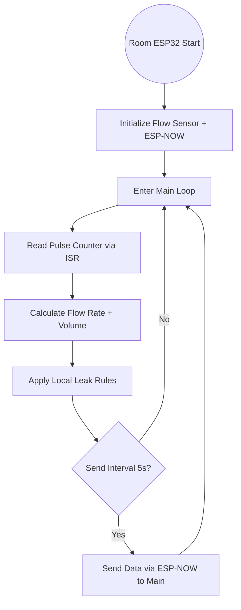
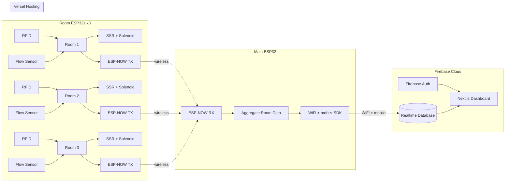
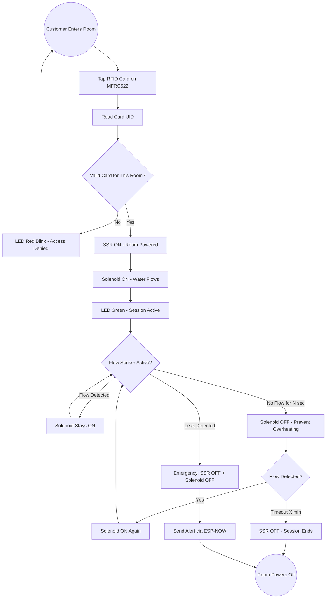
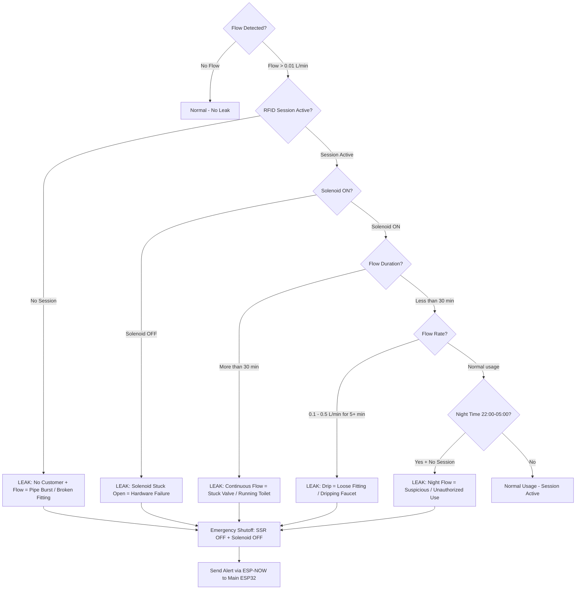
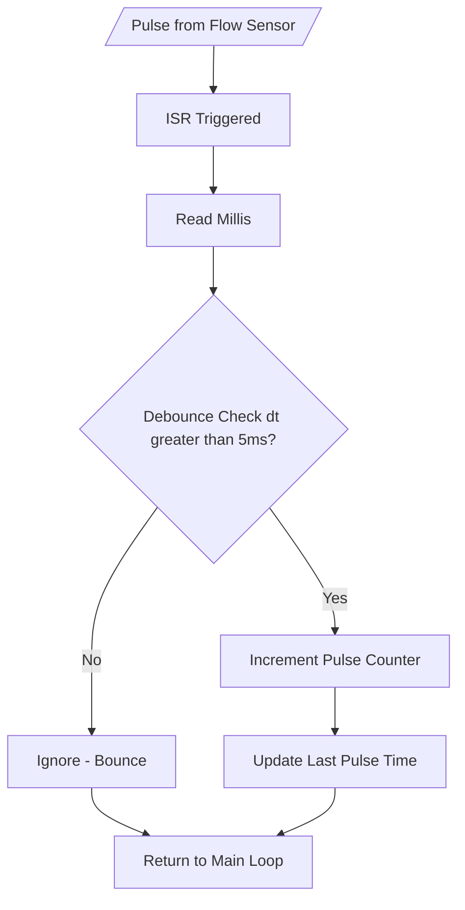
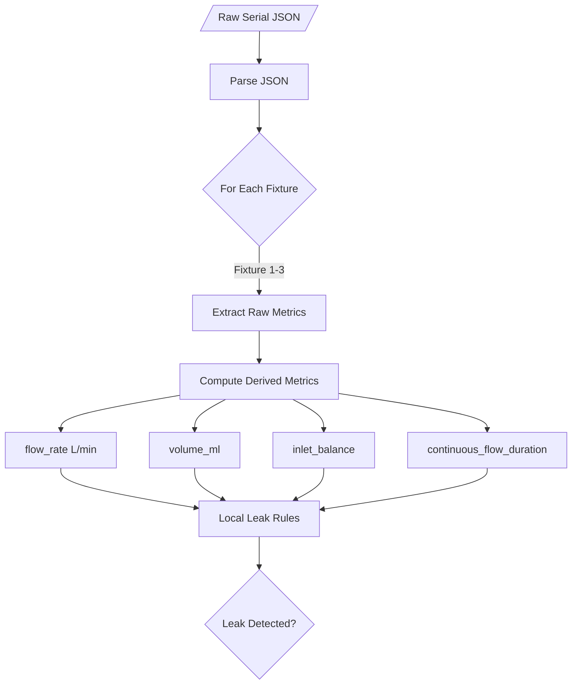
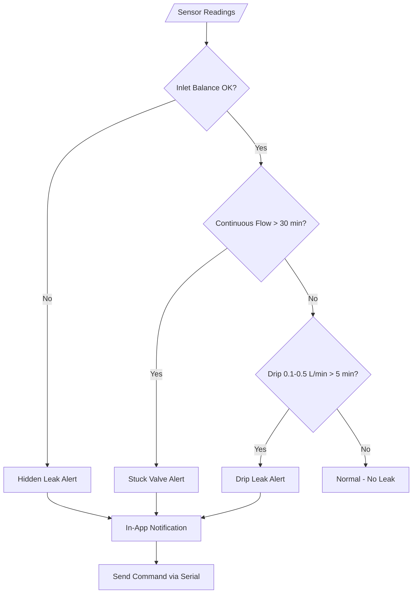
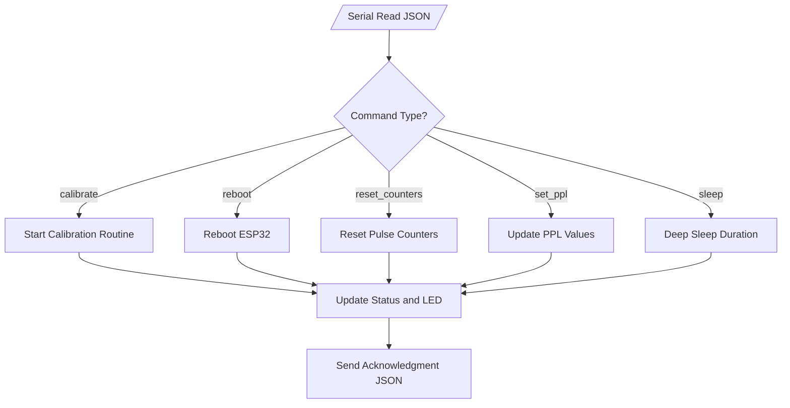
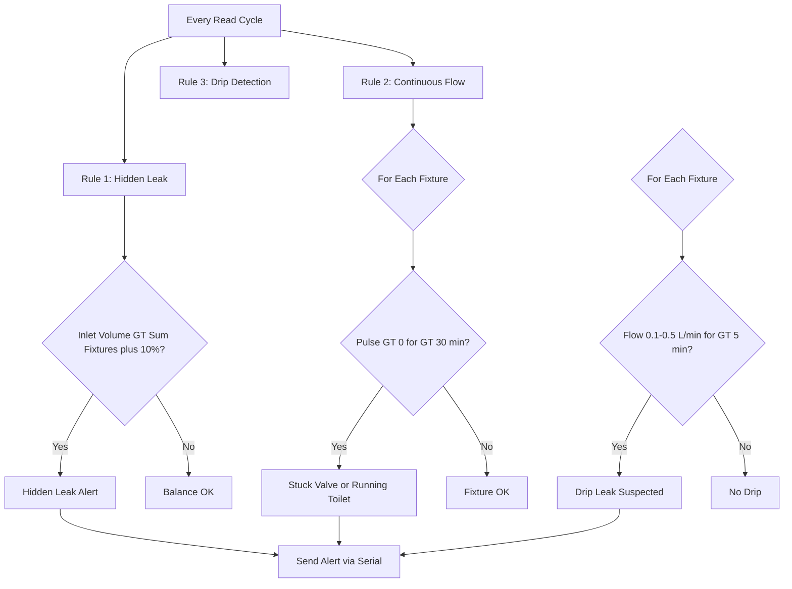
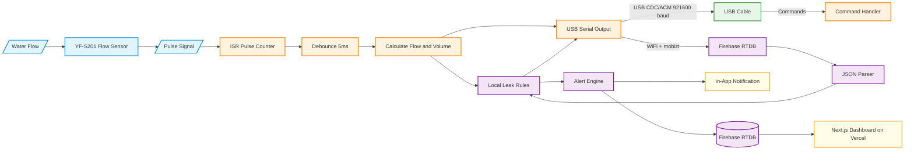

# Flowchart — Water Meter with Leak Detection (ESP-NOW + WiFi → Firebase)

## 1. Main System Flow (High-Level)

> Mermaid-based diagram (SVG export removed; source below)

<b> Mermaid Source</b> (click to expand)

> Room ESP32s transmit wirelessly via ESP-NOW. The main ESP32 aggregates and pushes to Firebase via WiFi.

---

## 2. Main ESP32 → Firebase Data Flow

> Mermaid-based diagram (SVG export removed; source below)

<b> Mermaid Source</b> (click to expand)

---

## 3. RFID Tap + Smart Solenoid Control

> Mermaid-based diagram (SVG export removed; source below)

<b> Mermaid Source</b> (click to expand)

> **Smart Solenoid Logic:** The solenoid is ONLY energized when the flow sensor detects water usage. When no flow is detected for N seconds, the solenoid automatically turns OFF to prevent overheating. It turns back ON when flow resumes. This allows continuous water use without damaging the solenoid.

---

## 4. Leak Detection Rules (6 Scenarios)

> Mermaid-based diagram (SVG export removed; source below)

<b> Mermaid Source</b> (click to expand)

> **6 Leak Detection Scenarios:**
> 1. **No RFID + Flow** = No customer in room but water flowing → CRITICAL
> 2. **Solenoid OFF + Flow** = Valve closed but flow persists → Hardware failure
> 3. **Continuous flow > 30 min** = Stuck valve / running toilet
> 4. **Drip (0.1–0.5 L/min) > 5 min** = Slow leak from loose fitting
> 5. **Night flow (22:00–05:00) no session** = Suspicious unauthorized usage
> 6. **Session ended + Flow** = Customer left but water continues → Solenoid stuck open
>
> **All rules trigger emergency shutoff:** SSR OFF + Solenoid OFF + Alert sent to Firebase → Next.js dashboard.

---

## 5. ESP32 ISR Pulse Processing

> Mermaid-based diagram (SVG export removed; source below)

<b> Mermaid Source</b> (click to expand)

---

## 4. Firebase RTDB Data Structure

> Mermaid-based diagram (SVG export removed; source below)

<b> Mermaid Source</b> (click to expand)

---

## 5. Local Leak Detection Rules

> Mermaid-based diagram (SVG export removed; source below)

<b> Mermaid Source</b> (click to expand)

---

## 6. ESP32 Serial Command Execution

> Mermaid-based diagram (SVG export removed; source below)

<b> Mermaid Source</b> (click to expand)

---

## 7. Local Leak Detection Rules (ESP32 Fallback)

> Mermaid-based diagram (SVG export removed; source below)

<b> Mermaid Source</b> (click to expand)

---

## 8. Full System Data Flow

> Mermaid-based diagram (SVG export removed; source below)

<b> Mermaid Source</b> (click to expand)

