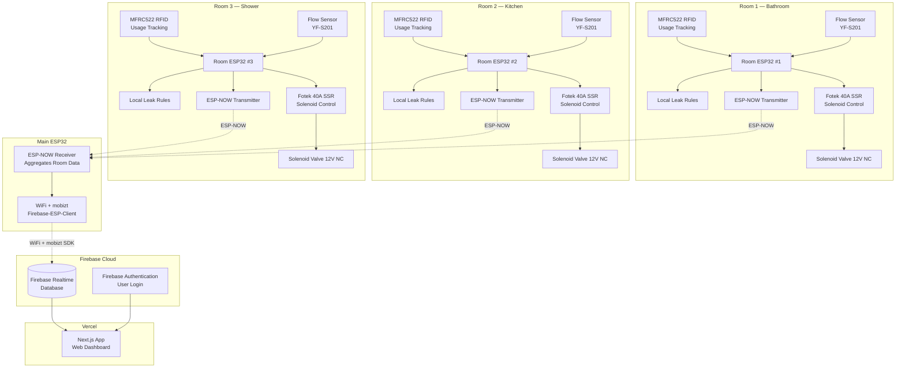

# System Architecture

## Overview

Smart water monitoring system with **per-room leak detection** using **ESP32 mesh (ESP-NOW) → Main ESP32 → WiFi → Firebase → Next.js on Vercel**.

3 room ESP32s each have an **MFRC522 RFID reader** (usage tracking), a **YF-S201 flow sensor** (consumption), and a **Fotek 40A SSR + solenoid valve** (emergency shutoff). Room ESP32s transmit readings wirelessly via **ESP-NOW** to a main ESP32. The main ESP32 connects to WiFi and pushes data directly to **Firebase Realtime Database** using the [mobizt Firebase-ESP-Client](https://github.com/mobizt/Firebase-ESP-Client) library. It also receives commands and callbacks from Firebase. The web dashboard is a **Next.js app deployed on Vercel** with **Firebase Authentication** for user login.

> **No Raspberry Pi needed!** ESP32 talks to Firebase directly via WiFi.

---

## Architecture Diagram

> Mermaid-based diagram (SVG export removed; source below)

<details>
<summary><b> Mermaid Source</b> (click to expand)</summary>



</details>

---

## Data Flow (End-to-End)

```
Step 1: RFID TAP (per room)
        Customer taps Mifare card on MFRC522 reader
        → Validate card against registered cards for this room
        → If valid: SSR ON (room powered) + Solenoid ON (water flows)
        → Log RFID tag + timestamp to SPIFFS / send via ESP-NOW

Step 2: SMART SOLENOID CONTROL
        Flow sensor monitors water usage:
        → Flow detected  = Solenoid stays ON (water in use)
        → No flow for N sec = Solenoid OFF automatically (prevent heating)
        → Next flow detected = Solenoid ON again
        → Solenoid is ONLY energized when water is actually flowing

Step 3: SESSION END
        → RFID timeout (no flow for X min) = SSR OFF (room power off)
        → Customer taps card again = session ends
        → Leak detected = SSR OFF + Solenoid OFF (emergency shutoff)

Step 4: ESP-NOW TRANSMISSION (every 5 sec)
        Room ESP32 → Main ESP32 (broadcast)
        → Payload: {room_id, rfid_tag, pulses, flow_rate_lpm, volume_ml,
                     ssr_state, solenoid_state, leak_alert}

Step 5: MAIN ESP32 → FIREBASE (WiFi + mobizt)
        Main ESP32 receives from all 3 rooms via ESP-NOW:
        → Aggregate room data into Firebase JSON structure
        → Push to Firebase RTDB using mobizt Firebase-ESP-Client
        → Path: /rooms/{room_id}/data, /rooms/{room_id}/alerts
        → Also reads commands from Firebase (remote shutoff, config updates)

Step 6: FIREBASE CLOUD
        → Realtime Database stores all room data, usage logs, alerts
        → Firebase Authentication handles user login (email/password or Google)
        → Real-time sync to all connected clients
        → ESP32 receives callbacks for remote commands

Step 7: USER ACTION (Next.js on Vercel)
        → User logs in via Firebase Auth
        → Dashboard displays real-time readings per room (Firebase RTDB listener)
        → Usage logs per person (RFID tag + duration + volume)
        → Leak alerts appear instantly (real-time sync)
        → User can send remote commands (shutoff, config) via Firebase → ESP32
```

---

## Communication Paths

| Path | Method | Protocol | Library |
|------|--------|----------|---------|
| RFID Card → Room ESP32 | SPI (MFRC522) | Mifare Classic | MFRC522 library |
| Flow Sensor → Room ESP32 | Pulse (GPIO interrupt) | Rising edge | Arduino ISR |
| Room ESP32 → SSR → Solenoid | GPIO HIGH/LOW | Digital signal | Arduino digitalWrite |
| Room ESP32 → Main ESP32 | ESP-NOW (wireless) | Binary payload | esp_now.h (built-in) |
| Main ESP32 → Firebase | WiFi + HTTPS | JSON (RTDB) | mobizt Firebase-ESP-Client |
| Firebase → Main ESP32 | WiFi + HTTPS | Callbacks/Streams | mobizt Firebase-ESP-Client |
| Firebase → Next.js | WebSocket (RTDB) | Real-time sync | Firebase JS SDK |
| User → Dashboard | HTTPS | Internet | Next.js + Firebase Auth |
| Dashboard → ESP32 | Firebase RTDB | Remote commands | mobizt stream + set |

---

## Key Design Decisions

| Decision | Rationale |
|----------|-----------|
| **ESP-NOW for room-to-main** | Low-latency, no WiFi router needed, works offline, peer-to-peer |
| **mobizt Firebase-ESP-Client** | Direct ESP32 → Firebase, no RPi bridge, stream + callback support |
| **WiFi on main ESP32 only** | Room ESP32s stay offline (ESP-NOW only) — saves power, no WiFi config per room |
| **SSR + solenoid per room** | Each room independently controls its own valve — local leak rules trigger shutoff |
| **RFID per room** | MFRC522 tracks who used water (tap card to log usage) |
| **Firebase RTDB** | Real-time sync, ESP32 reads/writes directly, no backend server needed |
| **Firebase Auth** | User login (email/password, Google sign-in) — no custom auth system |
| **Next.js on Vercel** | Serverless, auto-deploy from Git, free tier sufficient |
| **No RPi needed** | ESP32 handles everything — WiFi, Firebase, sensors, RFID, SSR |
| **6 Leak Detection Rules** | No RFID+flow, session ended+flow, solenoid OFF+flow, continuous flow, drip, night flow |
| **RFID-based leak context** | RFID session state tells firmware whether flow is expected or a leak |
| **Check Valves per Room** | Prevents backflow contamination between rooms |
| **SPIFFS Backup** | Survives WiFi disconnects — data cached locally until reconnect |
| **921600 baud** | High throughput for 3 rooms × 5 sec interval; reliable on CP2102/CH340 |

---

## Hardware Summary

| Component | Qty | Purpose |
|-----------|-----|---------|
| ESP32 38-Pin Dev Board | 4 | 3 room + 1 main |
| ESP32 38-Pin Expansion Board | 4 | Screw terminals for wiring |
| MFRC522 RFID Reader | 3 | 1 per room — usage tracking |
| YF-S201 Flow Sensor | 3 | 1 per room (bathroom, kitchen, shower) |
| Fotek 40A SSR | 3 | 1 per room — controls solenoid valve |
| Solenoid Valve 1/2" NC | 3 | 12V DC, normally closed — shutoff on leak |
| Check Valve 1/2" | 3 | One per room (backflow prevention) |
| 12V 5A Switching PSU (S-60-12 / LRS-60-12) | 1 | Mains power → 12V |
| LM2596S Buck Converter | 1 | 12V → 5V for ESP32s + sensors |
| Waterproof ABS Enclosure IP67 (175×125×75mm) | 4 | One per ESP32 |
| ~~Raspberry Pi~~ | ~~1~~ | ~~Serial-to-Firebase bridge~~ — **NO LONGER NEEDED** |

---

## Power Architecture

```
220V AC Outlet
    │
    ▼
12V 5A Switching PSU (S-60-12 / LRS-60-12)
    │
    ├──► 12V Rail (future 12V components)
    │
    ▼
LM2596S Buck Converter (12V → 5V)
    │
    ├──► Main ESP32 VIN (5V)
    │
    ├──► Room ESP32 ×3 (via USB or separate buck)
    │
    ▼
Flow Sensors VCC (5V) × 3

USB from power bank → Main ESP32 (backup power, optional)
```

> Each room ESP32 connects to: MFRC522 RFID (SPI), YF-S201 flow sensor (GPIO 26), Fotek 40A SSR (GPIO 25) for room power, and 1-ch 10A relay (GPIO 13) for solenoid valve control. Main ESP32 connects to WiFi and Firebase directly — no RPi needed. SSR powers room electrical line on RFID tap. Relay controls solenoid — smart auto on/off prevents overheating.

---

## References

- [Raspberry Pi OS Documentation](https://www.raspberrypi.com/documentation/computers/os.html)
- [Raspberry Pi Imager GitHub](https://github.com/raspberrypi/rpi-imager)
- [Raspberry Pi Forums - OS Installation](https://forums.raspberrypi.com/viewforum.php?f=117)
- [Debian Trixie Release Notes](https://www.debian.org/releases/trixie/)